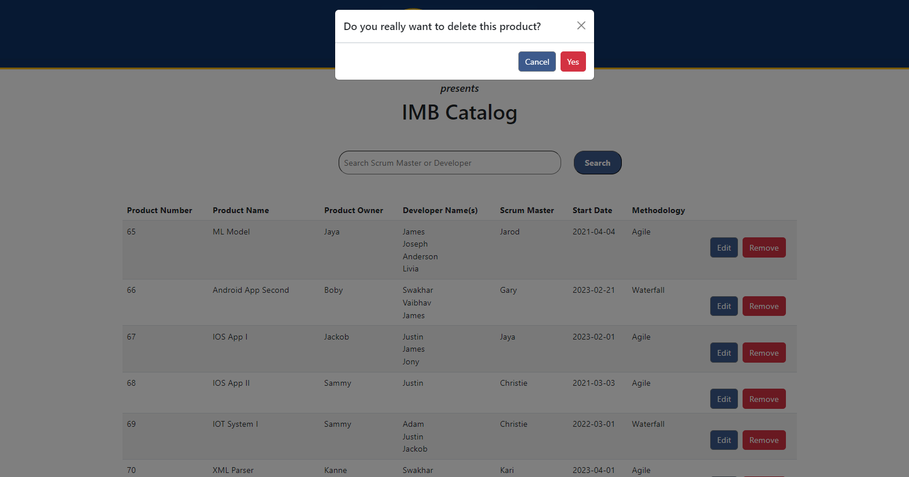
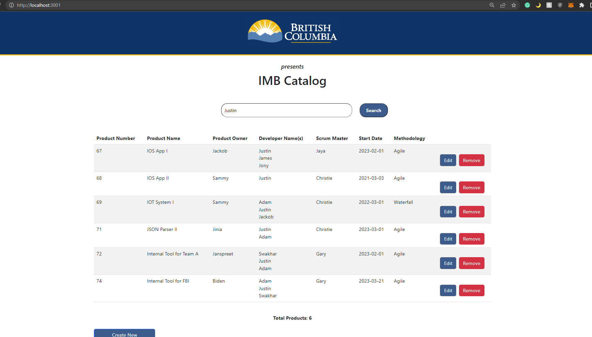

# Swakhar-Poddar-IS24-full-stack-competition-req97073

Repository for competition for Gov of BC. This repo contains the web app for IMB Catalog task.

<br></br>

## Project Structure

This is the root of the project.

<li> backend: contains the backend code Django, and the SQL Lite Database </li>
<li> frontend: contains the frontend code for react framework </li>

<br></br>

## Technologies Used

<li> Django (version 4.1.5) </li>
<li> React (version 18.2.0) </li>

<br></br>

## Dependencies

<b><u> Backend </u></b>

<li> Python 3 Setup </li>
<li> PIP </li>
<li> Django </li>
<li> Django Rest Framework </li>
<li> Django Cors Headers </li>
<li> drf-yasg </li>
<b><u> Frontend </u></b>
<li> NodeJS </li>
<li> Bootstrap </li>
<li> Reactstrap </li>
<li> Axios </li>

<br></br>

## Getting Started

Instructions on how to get the project up and running on a local machine for development and testing purposes.

### Prerequisites & Installing

Make sure all the Dependencies are installed. Use pip or npm to install those dependencies. For front end dependencies install them on the frontend root of the repo. Or if NodeJS and NPM is installed, you can do like the following example:

```
cd frontend
npm install
```

For Backend this commands might come handy

```
pip install django djangorestframework django-cors-headers
pip install drf-yasg
```

### Running

Once all the Prerequisites are done installing now we should be ready to run the webapp. First we will start the backend at localhost:3000 port

```
cd backend
python manage.py runserver
```

Note: By any chance if shows migration error run this lines before

```
python manage.py makemigrations
python manage.py migrate
```

Now lets start the front end at a different port than 3000

```
cd frontend
npm start
```

The project should be running with all the features, if any support is needed to get it started please do contact me at spoddar@student.ubc.ca or open an issue on the repo.

### Documentation

The API documentation can be found on http://localhost:3000/api/api-docs feel free to play around the APIs from the swagger UI

Other than that code is also explained by small comments on the .py or .js files.

## Features

### User Story 1

As Lisa, I want to see a list of all products that IMB currently develops or maintains in a list view.

Given that I don't need to be an authorized user
When I navigate to the application landing page
I can see a list of all products within IMB
And all relevant information related to each product

Product Number, Product Name, Scrum Master, Product Owner, Developer Names, Start Date, Methodology

<br></br>

- Screenshots


- Video

[](https://www.youtube.com/watch?v=oldwQpbMjBw)

<br></br>

### User Story 2

As Lisa, I want to be able to add a product to the list of products that IMB is developing or maintaining. Given that I am on the product view list
When I click add new product call to action button
Then I am able to answer the following questions on a form: Product Name, Scrum Master, Product Owner, Developer Names, Start Date, Methodology and add the product.

<br></br>

- Screenshots


- Video

[](https://www.youtube.com/watch?v=0bltztDUEtM&feature=youtu.be)

<br></br>

### User Story 3

As Alan, I want to be able to add or edit product related information so that I can ensure that product data is accurate. Given that I don't need to be an authorized user When I am on the list page and I click on an edit button
Then I am able to edit the following fields: Product Name, Scrum Master, Product Owner, Developer Names, Start Date, Methodology and add the product.

<br></br>

- Screenshots




- Video

[](https://www.youtube.com/watch?v=3zOP2-c-A58)

[](https://www.youtube.com/watch?v=vMu7rA3RO-E)

<br></br>

### User Story 4 & 5

As Lisa, I want to search for a specific Scrum Master name so that I can see all of the products that they are currently working on. Given that I don't need to be an authorized user. When I am on the list view page. Then I can search for a specific person in the Scrum Master role
<br></br>
As Alan, I want to search for a specific Developer name so that I can see all of the products that they are currently working on. Given that I don't need to be an authorized user. When I am on the list view page I can search for a specific developer.

<br></br>

- Screenshots




- Video

[](https://www.youtube.com/watch?v=7xow1NUcSXQ)

<br></br>

### Healthy Endpoint (Backend Server Turned Off)

- Screenshots


- Video

[](https://www.youtube.com/watch?v=xNtEslyE2bg)

<br></br>

## Thanks for your time to this repo 🙌
<br></br> 
Swakhar Poddar
<br>
www.poddar.xyz 